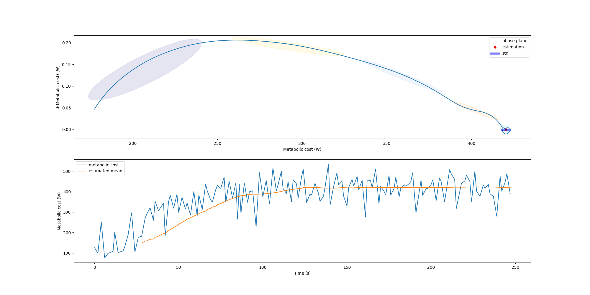

# HIL Toolkit: Acquisition, estimation and optimization of human in the loop experiments
Toolkit for human in the loop optimization

> **Note**
> For the most updated version of the code please visit [https://github.com/HIL-Framework/HIL-toolkit/tree/dev-release](https://github.com/HIL-Framework/HIL-toolkit/tree/dev-release)


## Table of contents
- [HIL Toolkit: Acquisition, estimation and optimization of human in the loop experiments](#hil-toolkit-acquisition-estimation-and-optimization-of-human-in-the-loop-experiments)
  - [Table of contents](#table-of-contents)
  - [Requirements for the toolkit](#requirements-for-the-toolkit)
    - [General requirements](#general-requirements)
    - [Metabolic cost.](#metabolic-cost)
    - [ECG](#ecg)
    - [Foot pressure.](#foot-pressure)
  - [Installation](#installation)
  - [Testing the installtion.](#testing-the-installtion)
  - [Device setups](#device-setups)
    - [ECG device setup](#ecg-device-setup)
  - [Estimation](#estimation)
  - [Metabolic cost estimation.](#metabolic-cost-estimation)
    - [Estimation in scripts for offline.](#estimation-in-scripts-for-offline)
    - [Estimation in notebooks.](#estimation-in-notebooks)


## Requirements for the toolkit

### General requirements
- Python 3.10 or higher.
- Labstreaminglayer - install [here](https://github.com/sccn/liblsl/releases). 
- pylsl - install by running `pip install pylsl`.

### Metabolic cost.
- Cosmed or other metabolic cart device.
- Setup metabolic cost acquisition code.

### ECG
- Polar H10
- Bluetooth capible laptop for ECG.

### Foot pressure.
- Pressure SDK.


## Installation
Complete python HIL toolkit install using pip in main directory.
```bash
pip install -e .
```

## Testing the installtion.
>#TODO

## Device setups
### ECG device setup
For setting up the new polar H10 ( ECG sensor )
- Please turn on the computer bluetooth connection.
- Run the following script to find all the available POLAR sensor scripts `python scripts/search_polar.py`. This script will search for polar sensors in the bluetooth range and save the BLE information in the `config/polar.yml` file. And return success or failure.
- Run the script to collect data from the polar and send it. `python scripts/collect_polar.py`


## Estimation

> **Warning**
> The estimation is not fully tested. Please use with caution.

## Metabolic cost estimation.

Please refer the following paper for the details of the estimation. 
> **Reference**
> 
> Kantharaju, Prakyath, and Myunghee Kim. "Phase-Plane Based Model-Free Estimation of Steady-State Metabolic Cost." IEEE Access 10 (2022): 97642-97650.
### Estimation in scripts for offline.
- Run the following script to estimate the metabolic cost. `python scripts/estimate_metabolic_cost.py`
- This script will estimate the estimate the metabolic cost data in the provided in the `data/met_data.npy`.
- The scrip will generate the estimation and the also video as shown in the following figure.

- It will also make a video of the estimation and the actual data. The video will be saved in the `scripts/Results/videos/` folder.


### Estimation in notebooks.
- Run the following notebook . `notebooks/preprocessing_cosmed.ipynb` to convert the raw data to the metabolic cost data.
- To perform the estimation run the following notebook. `notebooks/estimation_cosmed.ipynb`
